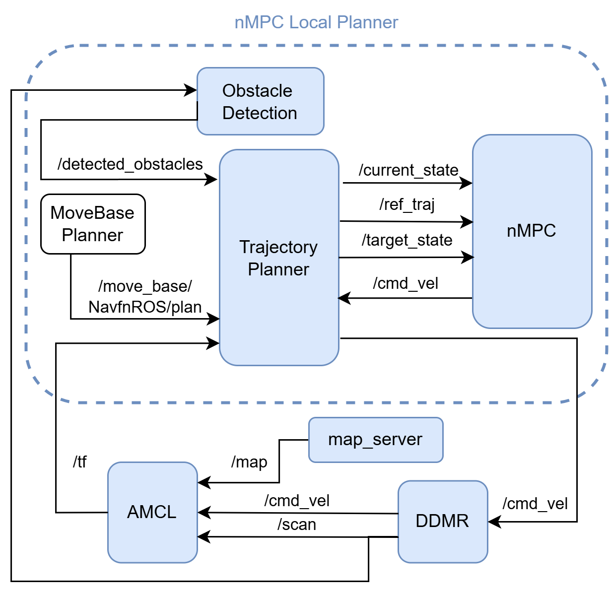
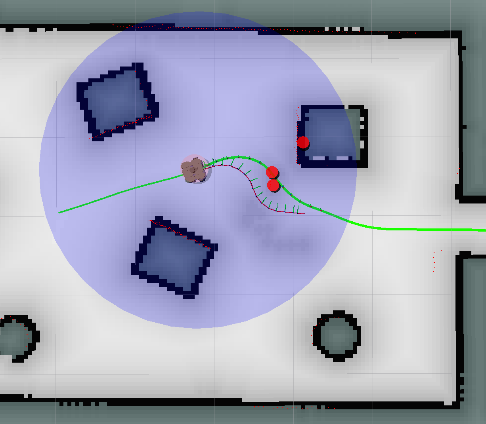
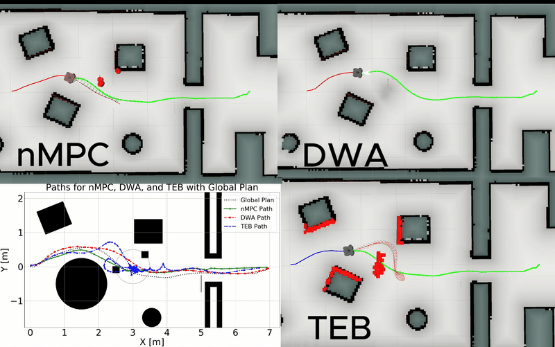

# nMPC Local Planner for ROS Noetic

This repository contains the implementation of a **nonlinear Model Predictive Control (nMPC)** based local planner for differential drive mobile robots. It integrates with the **ROS Noetic Navigation Stack** and features real-time **dynamic obstacle avoidance**, efficient trajectory tracking, and simulation support with TurtleBot in Gazebo.

---

## 📸 System Architecture



---

## 🖼️ Demo Snapshot



---

## 🎞️ Demo Animation



---

## 🚀 Getting Started

### 1. Clone this Repository

```bash
git clone https://github.com/KevinEppacher/walle_ws.git
cd walle_ws
```

---

## 🐳 Run with Docker (recommended)

### 2. Setup Docker Environment

Make sure you have the following installed:
- [Docker](https://www.docker.com/)
- [Visual Studio Code](https://code.visualstudio.com/)
- [NVIDIA Container Toolkit](https://docs.nvidia.com/datacenter/cloud-native/container-toolkit/install-guide.html)
- VS Code Extension: **Dev Containers** + **Docker**

Then run:

```bash
cd .devcontainer
docker compose up gpu
```

> Make sure your GPU drivers are compatible with the container setup.

---

### 3. Open the Dev Container in VS Code

- Open VS Code → **Docker tab** → locate `ros/control` container
- Right-click → **Attach to Container**
- A new VS Code window will open inside the container
- Open terminal inside this container

---

### 4. Set Up the Workspace

```bash
catkin_make
source devel/setup.bash
```

---

## 🧪 Start Simulation

Run the simulation with TurtleBot and the custom nMPC planner:

```bash
roslaunch amr_control walle_simulation.launch
```

---

## 🛠 Parameter Tuning

All nMPC-related parameters can be adjusted in the following config file:

```
src/amr_control/param/optimal_control_params.yaml
```

Key parameters include:
- Prediction Horizon
- Weight Matrices (Q/R)
- Obstacle Constraints
- Velocity Bounds

---

## 🧾 License

MIT License

---

## 📄 Documentation

You can find the full project documentation, scientific background, and presentation below:

- [📘 Project Paper (PDF)](src/amr_control/docs/2024-09-24_Eppacher_Spezialsierung_2.pdf)
- [📽️ Project Presentation (PPTX)](src/amr_control/docs/nMPC_Local_Planner_Presentation.pptx)

These files provide deeper insights into the design, theory, and evaluation of the implemented nMPC local planner.

---

Happy coding! 🚀
